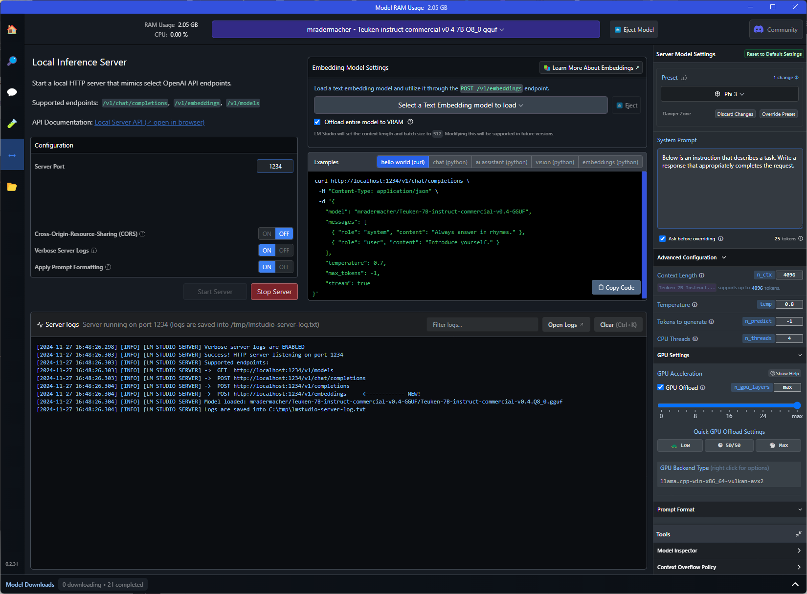
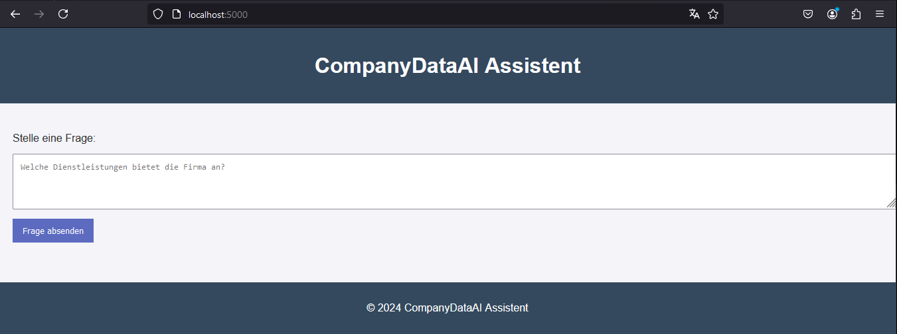

# CompanyDataAI
PoC to gather data from company websites and an web interface to ask an AI about it

1. Clone Repository

2. Create virtual environment and install requirements:
```bash
# Python virtual Environment
python -m venv CompanyDataAI
## Activate
source CompanyDataAI/bin/activate

# Install requirements
pip install -r requirements.txt
```

3. Start MongoDB
```bash
docker stop CompanyDataAI-mongo && docker rm CompanyDataAI-mongo
docker run --name CompanyDataAI-mongo -d -p 27017:27017 mongo
```

4. Scrap pages
```bash
cd scrapper
scrapy crawl fullsite
```

5. Create Index\
Open Mongo Client and execute:
```bash
use firmendaten
db.fullsite.dropIndexes();
db.fullsite.createIndex(
  { cleaned_text: "text" },  // Das Feld, das durchsucht werden soll
  { default_language: "german" }  // Sprache für den Textindex
);
```

6. local AI\
Start server in LM Studio with Model [mradermacher/Teuken-7B-instruct-commercial-v0.4-GGUF/Teuken-7B-instruct-commercial-v0.4.Q8_0.gguf](https://huggingface.co/mradermacher/Teuken-7B-instruct-commercial-v0.4-i1-GGUF).\
Set Context Lenght to 4096.\


7. configure local AI in project\
I run LM Studio on Windows, but webapp on WSL. So the IP of Windows environment has to be set in file ```webapp/app.py```, because ```localhost``` is not working in this setup.

8. Start WebApp
```bash
cd webapp
python app.py
```

9. Use WebApp\
Open [http://localhost:5000/](http://localhost:5000/) and enter your questions.\
